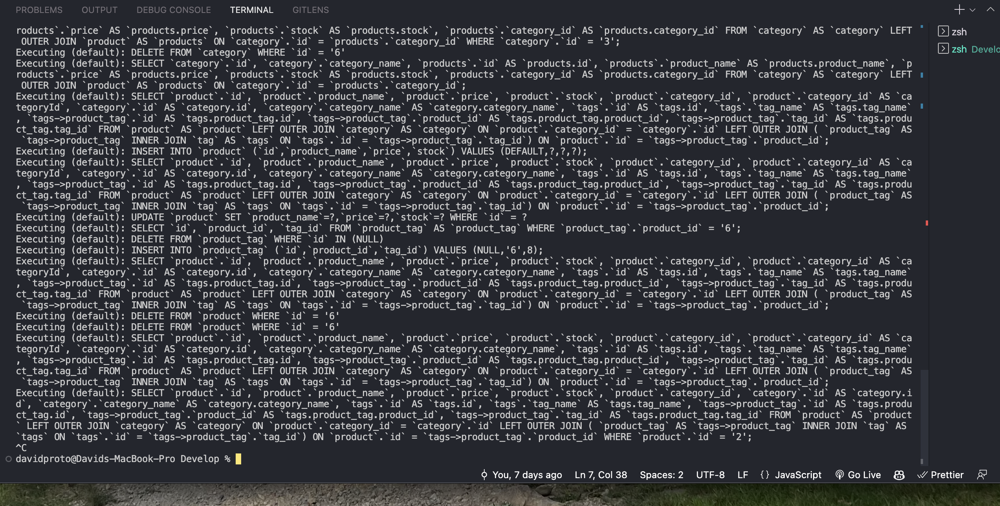
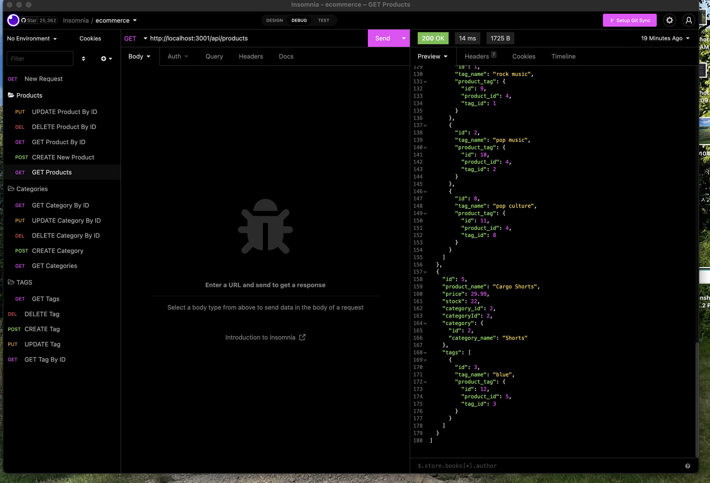

# Object-Relational Mapping (ORM) Challenge:  E-Commerce Back End

## Description

This is a MySQL database and a backend application for an e-commerce site.  It was built using MySQL2, Express, Sequelize and dotenv.

## User Story 

AS A manager at an internet retail company
I WANT a back end for my e-commerce website that uses the latest technologies
SO THAT my company can compete with other e-commerce companies

## Acceptance Criteria

GIVEN a functional Express.js API
WHEN I add my database name, MySQL username, and MySQL password to an environment variable file
THEN I am able to connect to a database using Sequelize
WHEN I enter schema and seed commands
THEN a development database is created and is seeded with test data
WHEN I enter the command to invoke the application
THEN my server is started and the Sequelize models are synced to the MySQL database
WHEN I open API GET routes in Insomnia Core for categories, products, or tags
THEN the data for each of these routes is displayed in a formatted JSON
WHEN I test API POST, PUT, and DELETE routes in Insomnia Core
THEN I am able to successfully create, update, and delete data in my database

## Installation

To get started, clone this repository to your local machine. In the root directory of the project, type in the terminal command line 'npm install' to download the dependencies. Initiate the database with 'mysql -u root -p', enter your password then 'source db/schema.sql' to create the tables. Exit the mysql terminal and from bash or zsh, type 'npm run seed' to seed the data into your tables. Now you can run 'npm start' to start your server!
## Walk Through Video of Application

https://drive.google.com/file/d/1aKFLuSD8JskacgdvvC7aUdTRLFEE5MVT/view

## ScreenShots

 
 

                    

